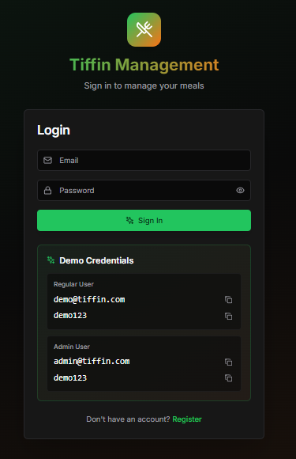
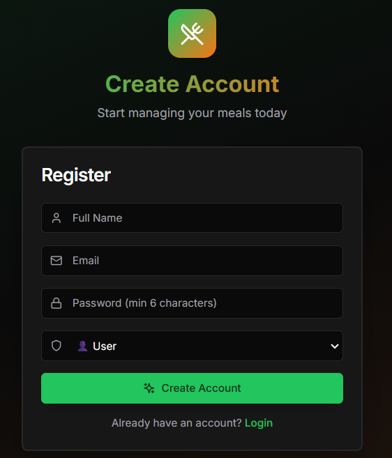
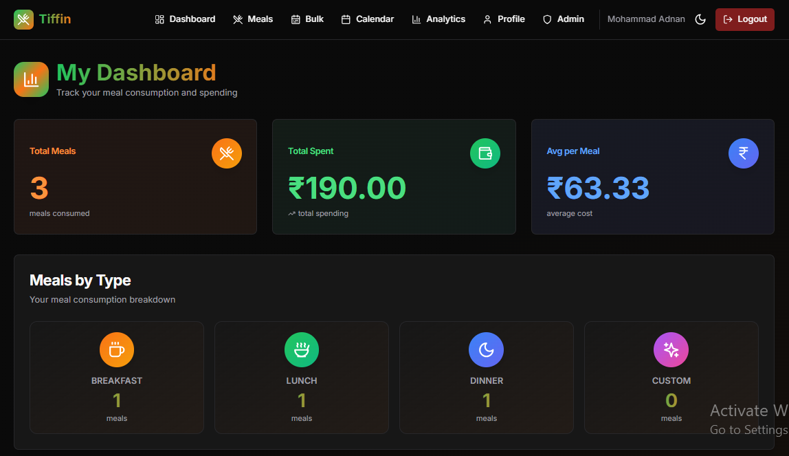

# Tiffin Management System

[](https://tiffin-management-service.vercel.app/)
[](https://github.com/mdadnan2/tiffin-management-service)
[](https://nestjs.com/)
[](https://nextjs.org/)
[](https://www.typescriptlang.org/)
[](https://www.prisma.io/)
[](https://www.postgresql.org/)

> A production-ready full-stack meal management application with enterprise-grade architecture, authentication, and real-time analytics.

---

## 🌐 Live Application

### 🚀 [**Try Live Demo →**](https://tiffin-management-service.vercel.app/)

**API Documentation:** [Swagger UI](https://tiffin-management-system-4uoa.onrender.com/api/docs#/)

**Demo Credentials:**
```
👤 User Account
   Email: demo@tiffin.com
   Password: demo123

👑 Admin Account
   Email: admin@tiffin.com
   Password: demo123
```

**Features to Explore:**
- 📊 Real-time dashboard with meal analytics
- 🍽️ Meal scheduling with bulk operations
- 📅 Interactive calendar view
- 💰 Dynamic pricing management
- 📱 Fully responsive mobile design
- 👥 Admin panel with user statistics

---

## 📸 Screenshots

### Login Page


### Register Page


### Dashboard


---

## ✨ Key Features

### 🔐 Authentication & Security
- JWT-based authentication with access & refresh tokens
- Bcrypt password hashing (10 rounds)
- Role-based access control (USER, ADMIN)
- Protected routes with guards
- Secure session management

### 🍽️ Meal Management
- Create, update, and cancel meals
- Bulk scheduling with date range selection
- Day-specific filtering (skip weekends, select specific days)
- Meal type categorization (Breakfast, Lunch, Dinner, Custom)
- Real-time price locking at meal creation
- Notes and special instructions

### 📊 Analytics & Insights
- Real-time dashboard with meal statistics
- Monthly and weekly breakdowns
- Meal type distribution charts
- Spending analytics
- Calendar view with visual indicators
- Admin panel with user statistics

### 💰 Dynamic Pricing
- Per-user customizable meal prices
- Price history tracking
- Automatic price calculation
- Total spending summaries

### 📱 Modern UI/UX
- Fully responsive mobile-first design
- Smooth animations with Framer Motion
- Dark mode support
- Interactive calendar with color-coded indicators
- Toast notifications for user feedback
- Loading states and error handling

---

## 🛠️ Technology Stack

### Backend
- **Framework:** NestJS (Node.js)
- **Language:** TypeScript
- **ORM:** Prisma
- **Database:** PostgreSQL 15
- **Authentication:** JWT + Passport
- **Validation:** class-validator, class-transformer
- **API Documentation:** Swagger/OpenAPI

### Frontend
- **Framework:** Next.js 14 (App Router)
- **Language:** TypeScript
- **Styling:** Tailwind CSS
- **UI Components:** shadcn/ui
- **Animations:** Framer Motion
- **State Management:** React Hooks
- **HTTP Client:** Axios

### DevOps & Deployment
- **Frontend Hosting:** Vercel
- **Backend Hosting:** Render
- **Database:** Supabase PostgreSQL
- **Version Control:** Git/GitHub
- **CI/CD:** Vercel Auto-Deploy

---

## 🚀 Quick Start

### Prerequisites
- Node.js 18+ (LTS recommended)
- PostgreSQL 15+
- npm or yarn

### Local Development Setup

1. **Clone the repository**
```bash
git clone https://github.com/mdadnan2/tiffin-management-service.git
cd tiffin-management-service
```

2. **Setup Backend**
```bash
cd backend
npm install
cp .env.example .env
# Edit .env with your database credentials
npm run migrate
npm run seed
npm run start:dev
```

3. **Setup Frontend**
```bash
cd frontend
npm install
cp .env.example .env.local
# Edit .env.local with backend URL
npm run dev
```

4. **Access the application**
- Frontend: http://localhost:3000
- Backend API: http://localhost:3001
- Swagger Docs: http://localhost:3001/api/docs

---

## 📚 API Documentation

**Live Swagger UI:** [https://tiffin-management-system-4uoa.onrender.com/api/docs#/](https://tiffin-management-system-4uoa.onrender.com/api/docs#/)

**Note:** First request may take 50+ seconds due to Render's free tier cold start.

### Key Endpoints

#### Authentication
- `POST /auth/register` - Register new user
- `POST /auth/login` - Login user
- `POST /auth/refresh` - Refresh access token
- `GET /auth/me` - Get current user

#### Meals
- `POST /meals` - Create meal
- `POST /meals/bulk` - Bulk create meals
- `GET /meals` - List meals
- `GET /meals/calendar` - Calendar view
- `PATCH /meals/:id` - Update meal
- `DELETE /meals/:id` - Cancel meal

#### Dashboard
- `GET /dashboard` - User dashboard
- `GET /dashboard/monthly` - Monthly stats
- `GET /dashboard/weekly` - Weekly stats

#### Admin (Admin only)
- `GET /admin/users` - List all users
- `GET /admin/users/:id/summary` - User summary

---

## 🛡️ Security Features

- 🔒 Bcrypt password hashing (10 rounds)
- 🎫 JWT authentication with refresh tokens
- 🚪 Role-based access control (RBAC)
- ✅ Input validation on all endpoints
- 🛡️ SQL injection prevention via Prisma ORM
- 🔐 Protected routes with authentication guards
- ⏱️ Token expiration (15min access, 7 days refresh)

---

## 🎯 Project Highlights

### Architecture
- ✅ Clean modular architecture
- ✅ Separation of concerns (Controller → Service → Repository)
- ✅ Dependency injection pattern
- ✅ Ready for microservices evolution

### Code Quality
- ✅ TypeScript for type safety
- ✅ ESLint + Prettier for code formatting
- ✅ DTO validation with class-validator
- ✅ Global exception handling

### User Experience
- ✅ Responsive mobile-first design
- ✅ Smooth animations and transitions
- ✅ Real-time feedback with toast notifications
- ✅ Loading states and error handling
- ✅ Dark mode support

---

## 📄 License

MIT License - feel free to use this project for learning and portfolio purposes.

---

## 🤝 Contributing

Contributions, issues, and feature requests are welcome!

---

## 📧 Contact

For questions or feedback, please open an issue on GitHub.

---

**Built with ❤️ using NestJS, Next.js, TypeScript, Prisma, and PostgreSQL**
